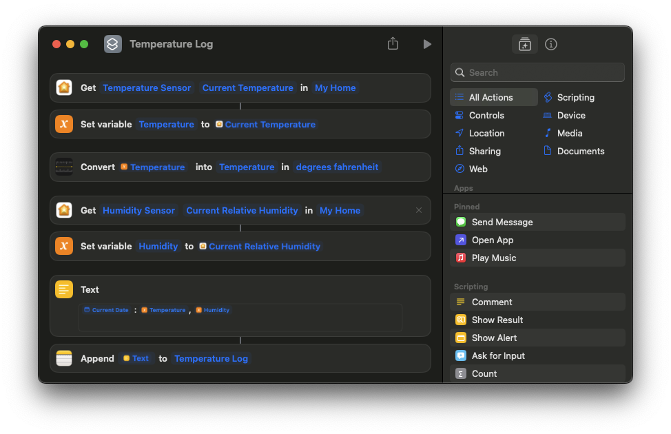
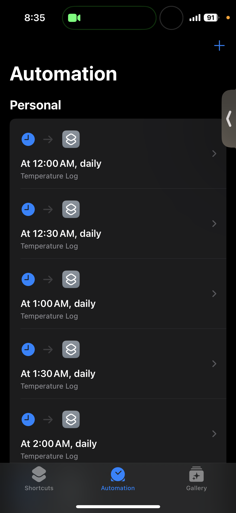
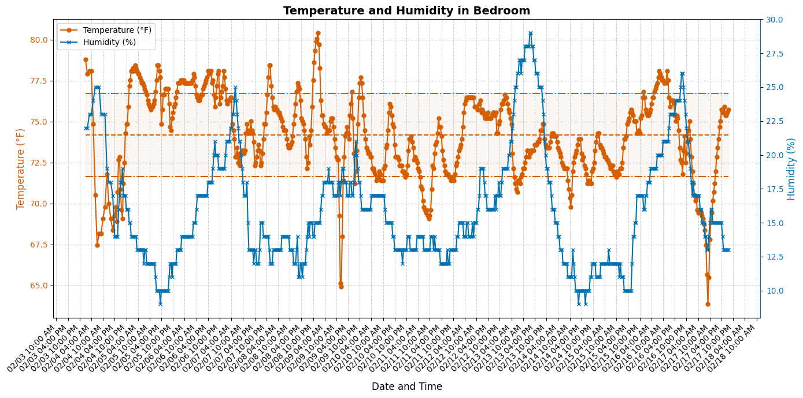

# HomePod-Temperature-Humidity

## How to use

1) Make a note called "Temperature Log" or another name if you want but make sure to change the name in the latter steps.
2) Make a shortcut like this:

3) Make automations like this: (make sure to select "Run Imediatly" when creating the automation)

4) (This is not an actionable step) Your note should look similar to [ExampleNote.txt](https://github.com/Noah-Everett/HomePod-Temperature-Humidity/blob/main/ExampleNote.txt) but with your data.

5) Run [plot.ipynb](https://github.com/Noah-Everett/HomePod-Temperature-Humidity/blob/main/plot.ipynb) to read in, analyze, and plot the data.

